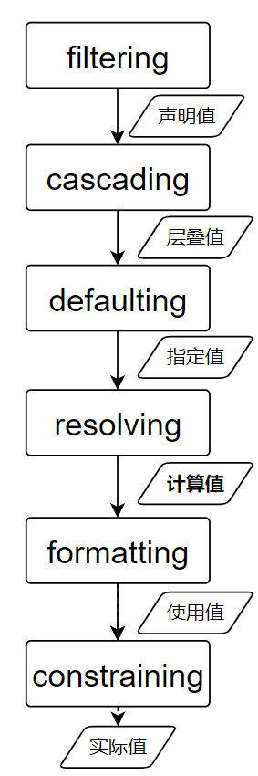

## CSS 样式值计算过程

流程图如下：

1. filtering
此过程会对样式值进行筛选，规则如下：
选择器匹配、属性有效、符合当前media等
此过程结束后会得到“声明值”
一个属性可以有0到多个声明值
比如 p{color: #000} p.text{color: #fff}

1. cascading
此过程会根据：
来源、important、选择器优先级、书写顺序等因素
选择优先级最高的属性值。
此过程结束后，胜出的那个属性值就是“层叠值”

1. defaulting
前面得到的层叠值为空时，会在这个过程中
为该属性使用一个 继承或初始值
此过程的作用是确保属性值不会是空值
结束后的得到的值叫做“指定值”（一定不为空）

1. resolving
前面得到的指定值，可能有关键字或者相对值
此过程中会将关键字或相对值转换为绝对值
比如 em 转换为 px、相对路径转换为绝对路径
此过程结束后得到的值叫“计算值”。
一般来说，计算值是浏览器在不进行实际布局的情况下能得到的最具体的值。
比如根元素的宽度为 60%，该宽度需要在实际布局后根据浏览器宽度才能得到具体的数值。所以此时还是以 60% 保存。
而一些字体的 60% 此时已经可以直接得出多少 px，不需要等到实际布局再进行计算。

1. formatting
此时会将计算值进一步转换成绝对值。
此过程的作用是消除相对值或关键字
此过程结束后得到的值都是绝对值，叫做“使用值”

1. constraining
此过程会将“使用值”中的小数像素值转换为整数
此时得到的值就是“实际值”，即渲染时实际生效的值

